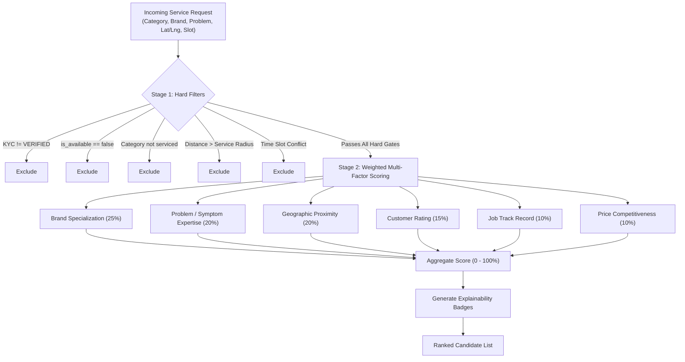
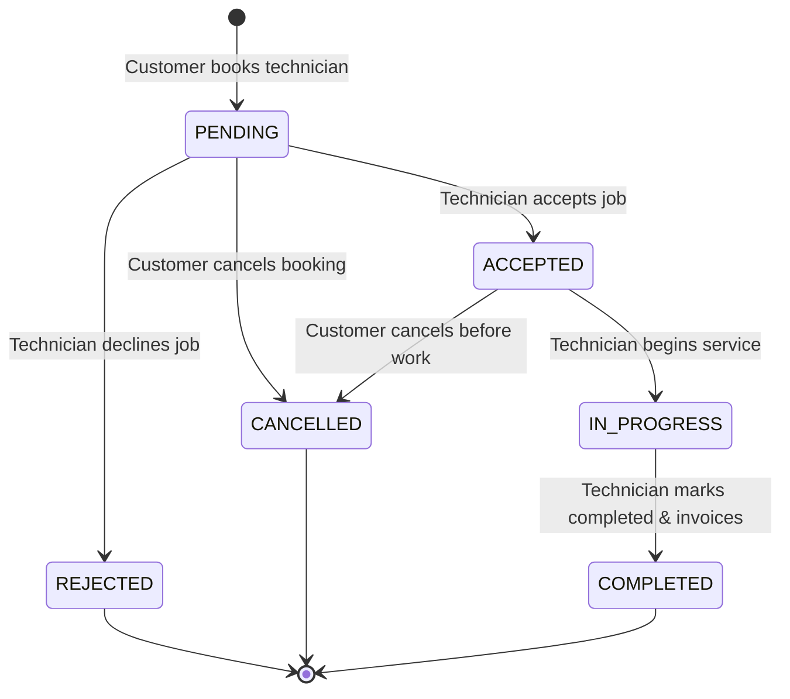
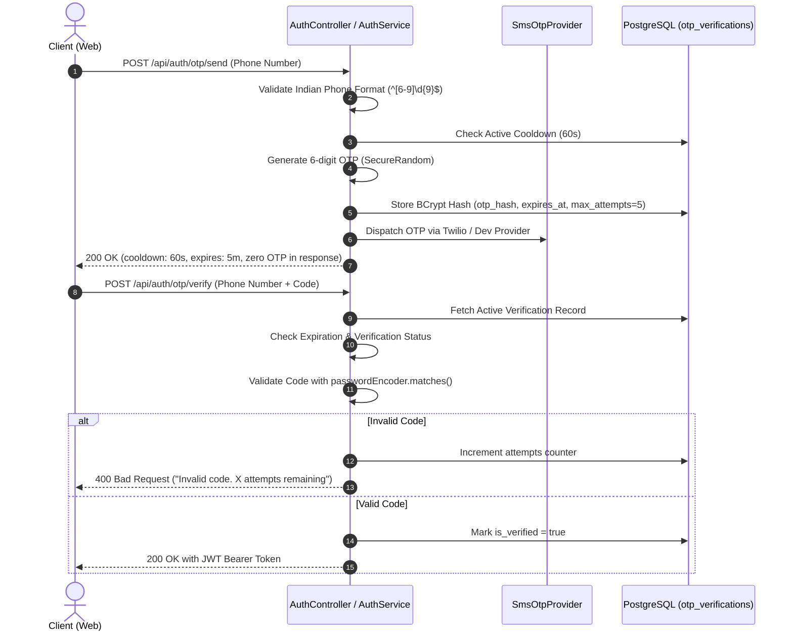
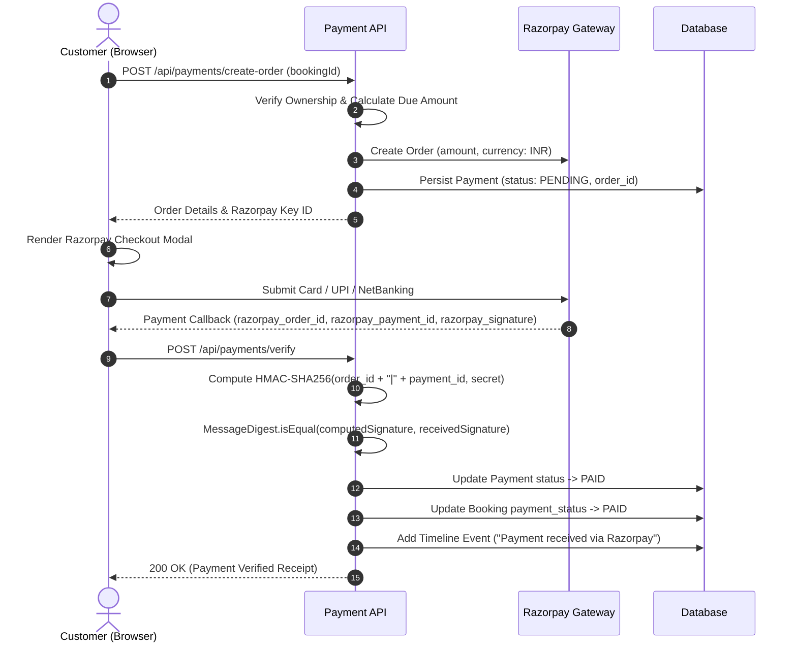

# RepairMatch 🛠️⚡
> **An algorithmic, on-demand household and daily-life repair marketplace that matches service requests to verified, specialized technicians.**

[](https://openjdk.org/)
[](https://spring.io/projects/spring-boot)
[](https://www.postgresql.org/)
[](https://react.dev/)
[](https://vitejs.dev/)
[](https://tailwindcss.com/)
[](LICENSE)

---

## 📌 Professional Summary

**RepairMatch** is a full-stack, enterprise-grade on-demand service marketplace designed to solve the structural inefficiencies of local home and appliance repair services. Rather than presenting static, uncurated technician directories, RepairMatch implements an **algorithmic multi-factor matching engine** that pairs customer repair requests with the highest-fit technician based on device brand and model expertise, symptom specialization, geographic proximity (Haversine distance), calendar availability, pricing competitiveness, and past verified performance.

The platform includes end-to-end user journeys for customers, technicians, and administrators, accompanied by a deterministic booking lifecycle state machine, dual-mode authentication (stateless JWT and rate-limited phone OTP), and an online payment integration supporting Razorpay checkout with cryptographic HMAC-SHA256 signature verification.

---

## ⚠️ Problem Statement

Finding reliable, competent technicians for home appliances and daily utility fixes is broken:
- **Generic Directories:** Most service platforms list contractors by generic category (e.g., "Electrician" or "Appliance Repair"), ignoring specific brand and component certifications (e.g., Apple logic board repairs or Daikin inverter compressor diagnostics).
- **Unchecked Availability:** Technicians receive booking requests while on another job or outside their realistic travel perimeter, leading to cancellations and delays.
- **Price Opacity:** Customers face arbitrary pricing on arrival without clear inspection rates or transparent invoicing.
- **Fake or Unverified Reviews:** Platforms often allow unverified accounts to post reviews, distorting trust.
- **Unreliable Scheduling:** Manual dispatch lacks finite state validation, resulting in lost bookings, double-bookings, and untracked service histories.

RepairMatch addresses each of these pain points with a rule-governed, data-driven architecture.

---

## 🚀 Key Features

- **16 Comprehensive Repair Categories:** Electronics (Smartphones, Laptops, Tablets, TVs), Large Appliances (ACs, Refrigerators, Washing Machines, Microwaves), Utilities (Geysers, RO Purifiers, Coolers, Inverters), and Home Trades (Electrical, Plumbing, Carpentry, Furniture Repair).
- **Two-Stage Multi-Factor Matching:** Hard constraint filtering (KYC verification, duty status, travel radius, schedule non-conflict) followed by weighted heuristic scoring (0–100%).
- **Deterministic Booking Lifecycle:** Formal finite state machine (`PENDING` ➔ `ACCEPTED` ➔ `IN_PROGRESS` ➔ `COMPLETED` / `CANCELLED` / `REJECTED`) with an immutable audit log (`booking_timeline`).
- **Dual Authentication System:** Standard email/password login and mobile phone OTP verification with rate-limiting, resend cooldown, and BCrypt-hashed token storage.
- **Online Payment Processing:** Integrated payment flow with Razorpay, enforcing backend cryptographic HMAC-SHA256 verification and idempotency controls.
- **Verified Customer Reviews:** 1-review-per-completed-booking restriction with atomic technician score and review count recalculation.
- **Technician Operating Console:** Real-time on-duty/off-duty availability toggle, live job queue, service status advancement, and invoicing tools.
- **Admin Governance Portal:** Platform metrics, KYC document verification queue, and user management directory.
- **Dark Mode Support:** System-aware theme toggle with persistent storage and WCAG-accessible contrast styling.

---

## 👤 User Workflows

### 1. Customer Workflow
1. **Browse or Diagnose:** Customer selects a service category from the homepage or initiates the 5-step Repair Diagnostic Wizard (`/wizard`).
2. **Device & Symptom Specification:** For appliances/electronics, the customer specifies the manufacturer and model, then selects the exact failure symptom from pre-seeded common fault profiles.
3. **Location & Schedule Selection:** Customer provides service location coordinates (or saved address) and selects an appointment date and convenient time window.
4. **Matched Recommendations:** The matching engine scores all qualified technicians, displaying explainable badges (`Brand Specialist`, `Nearby (X km)`, `Top Rated`, `Expert in this issue`).
5. **Instant Booking & Tracking:** Customer confirms the request. The booking appears on their tracking dashboard (`/bookings`) with real-time lifecycle tracking.
6. **Online Payment & Review:** Once invoiced or completed, the customer can pay online via the integrated checkout modal and submit a verified 5-star review.

### 2. Technician Workflow
1. **Onboarding & KYC:** Technicians register with credentials, service radius, inspection fee, and categories/brands/problems they specialize in. Account starts in `PENDING` status.
2. **Duty Toggle:** Verified technicians switch their status between `On Duty` and `Off Duty` directly from their dashboard (`/technician`).
3. **Job Dispatch:** Incoming booking requests appear in the technician's queue with device details, reported fault, customer address, and schedule.
4. **Lifecycle Progression:** Technician accepts the request, marks `In Progress` upon arrival, and enters final repair costs upon job completion.
5. **Reputation Monitoring:** Technicians view verified customer ratings and feedback transparently in their profile console.

### 3. Administrator Workflow
1. **Metrics Dashboard:** Real-time visibility into active users, registered technicians, total bookings, and platform activity.
2. **KYC Document Verification:** Admin reviews technician identity documents and approves or rejects credential applications with a single click.
3. **User Governance:** Filterable directory of all platform customers, technicians, and administrators with role-based visibility.

---

## 🧠 Intelligent Technician Matching Engine

The matching engine (`POST /api/matching/find`) processes candidates through two stages:



### Scoring Formula
$$\text{Score} = w_{\text{brand}} + w_{\text{problem}} + w_{\text{distance}} + w_{\text{rating}} + w_{\text{history}} + w_{\text{price}}$$

| Factor | Weight | Evaluation Criteria |
| :--- | :---: | :--- |
| **Brand Specialization** | **25%** | Awarded if technician has certified expertise with the specific manufacturer (e.g. Apple, Samsung, Daikin). |
| **Problem Expertise** | **20%** | Awarded if technician has explicitly registered skill in the diagnosed symptom. |
| **Proximity Score** | **20%** | Linear distance decay: closer technicians receive higher points based on Haversine distance up to their service radius. |
| **Customer Rating** | **15%** | Linear scaling from verified customer rating average ($\frac{\text{Rating}}{5.0} \times 15$). |
| **Track Record** | **10%** | Tiered by completed jobs: $\ge 50$ jobs (10 pts), $\ge 20$ (7 pts), $\ge 5$ (4 pts). |
| **Price Competitiveness** | **10%** | Inversely proportional ratio comparing technician inspection fee against the category average. |

---

## 🔄 Booking Lifecycle State Machine



- **Validation:** Every transition is checked against valid transition rules in `BookingStateMachine`. Illegal transitions return `400 Bad Request`.
- **Auditability:** Every transition automatically records an entry in `booking_timeline` with timestamp and note.
- **Side Effects:** Marking a booking `COMPLETED` increments the technician's completed job count, marks payment eligible, and unlocks customer review submission.

---

## 🔐 Authentication & Security

- **Stateless JWT Tokens:** Issues HMAC-SHA256 signed JSON Web Tokens (`app.jwt.secret`) valid for 24 hours. The `JwtAuthenticationFilter` validates tokens on every API request.
- **Password Security:** All passwords are salted and hashed using BCrypt via Spring Security's `PasswordEncoder`. Plaintext passwords are never stored.
- **Role-Based Access Control (RBAC):** Endpoints are protected by Spring Security method rules enforcing `CUSTOMER`, `TECHNICIAN`, or `ADMIN` roles.
- **CORS Protection:** Configurable allowed origins (`CORS_ALLOWED_ORIGINS`) prevents cross-site scripting vulnerabilities.

---

## 📱 Mobile OTP Architecture

The platform supports phone-number-based authentication for customers and technicians alongside password sign-in.



### Security Safeguards:
1. **BCrypt Storage:** Plaintext OTPs are never stored in the database.
2. **Indian Phone Validation:** Enforces standard 10-digit mobile numbering (`^[6-9]\d{9}$`).
3. **Resend Cooldown:** 60-second minimum interval between OTP requests.
4. **Brute-Force Rate Limiting:** Locked after 5 failed verification attempts.
5. **Single-Use:** Once verified, an OTP record is immediately invalidated.
6. **Zero Leakage:** The OTP code is never exposed in API responses or production logs.
7. **Provider Abstraction:** `SmsOtpProvider` interface allows switching between `dev` (simulation), `twilio`, and other SMS gateways via configuration.

---

## 💳 Online Payment Architecture (Razorpay)

Payment for inspection and repair fees is handled through an integrated Razorpay workflow:



### Payment Features:
- **Cryptographic Verification:** Signatures are computed using Java's `javax.crypto.Mac` (`HmacSHA256`) and compared in constant time (`MessageDigest.isEqual`) to prevent timing attacks.
- **Idempotency Guard:** Duplicate callbacks for already-paid transactions return the existing `PAID` record safely.
- **Comprehensive Lifecycle States:** `PENDING`, `AUTHORIZED`, `PAID`, `FAILED`, `REFUNDED`, `CANCELLED`.
- **Audit Integration:** Verified payments automatically update booking records and write audit events to `booking_timeline`.

---

## 🛠️ Technology Stack

| Layer | Technology | Purpose |
| :--- | :--- | :--- |
| **Backend Framework** | Java 21 / 23, Spring Boot 3.3.4 | RESTful API, dependency injection, and security |
| **Persistence & ORM** | Spring Data JPA, Hibernate 6 | Relational data mapping and repository abstraction |
| **Database** | PostgreSQL 16 (H2 for tests) | Production relational data storage |
| **Migrations** | Flyway 10.x | Version-controlled, idempotent database schema migrations |
| **Security** | Spring Security 6, JJWT 0.12.6, BCrypt | Token authentication, password hashing, and endpoint authorization |
| **Frontend Framework** | React 18, Vite 5 | Reactive Single Page Application |
| **Styling & UI** | Tailwind CSS 3, Lucide React | Clean, responsive, and dark-mode-ready interface |
| **State & Routing** | React Context API, React Router DOM 6 | Client-side routing and authentication state management |
| **HTTP Client** | Axios | Interceptor-based HTTP client with automatic token attachment |
| **Testing** | JUnit 5, Mockito, Spring Boot Test, MockMvc | Comprehensive automated unit and integration testing |

---

## 🏛️ System Architecture

```
                               ┌─────────────────────────────┐
                               │   React 18 + Vite SPA       │
                               │   (Port 5173)               │
                               └──────────────┬──────────────┘
                                              │ HTTP / JSON
                                              │ (Bearer JWT)
                                              ▼
┌────────────────────────────────────────────────────────────────────────────────────────┐
│ Spring Boot 3 Backend Service (Port 8080)                                               │
│                                                                                        │
│  ┌────────────────────────┐  ┌────────────────────────┐  ┌──────────────────────────┐  │
│  │ Security & Filters     │  │ Domain Controllers     │  │ Business Services        │  │
│  │ • JwtAuthFilter        │  │ • AuthController       │  │ • AuthService            │  │
│  │ • SecurityConfig       │  │ • MatchingController   │  │ • MatchingEngineService  │  │
│  │ • CorsConfig           │  │ • BookingController    │  │ • BookingStateMachine    │  │
│  │ • GlobalExceptionHandler│ │ • PaymentController    │  │ • PaymentService         │  │
│  └────────────────────────┘  │ • CatalogController    │  │ • CustomerService        │  │
│                              │ • TechnicianController │  │ • TechnicianService      │  │
│                              │ • AdminController      │  │ • ReviewService          │  │
│                              └────────────────────────┘  └──────────────────────────┘  │
│                                           │                                            │
│                                           ▼                                            │
│                              ┌────────────────────────┐                                │
│                              │ Spring Data JPA        │                                │
│                              │ Repositories           │                                │
│                              └────────────┬───────────┘                                │
└───────────────────────────────────────────┼────────────────────────────────────────────┘
                                            │ JDBC
                                            ▼
                               ┌────────────────────────┐
                               │ PostgreSQL Database    │
                               │ (Port 5432)            │
                               │ • 15 Relational Tables │
                               │ • Flyway Migrations    │
                               └────────────────────────┘
```

---

## 🗄️ Database Schema Overview

The database contains 15 tables managed across 4 Flyway migrations:

1. **`users`**: Platform accounts (Customer, Technician, Admin) with BCrypt password hashes.
2. **`addresses`**: Customer doorstep locations with geospatial coordinates (`latitude`, `longitude`).
3. **`technician_profiles`**: Operating details (radius, bio, KYC document, inspection fee, ratings).
4. **`categories`**: 16 primary service categories with iconography and brand requirements.
5. **`brands`**: Device manufacturers (Apple, Samsung, Daikin, LG, etc.).
6. **`models`**: Specific appliance/device models mapped to brands.
7. **`problem_types`**: Common symptom definitions with estimated baseline repair costs.
8. **`category_brands`**: Many-to-many relationship mapping categories to supported brands.
9. **`technician_categories`**: Service categories covered by each technician.
10. **`technician_brands`**: Specific manufacturer certifications held by technicians.
11. **`technician_problems`**: Specialization in specific repair symptoms.
12. **`bookings`**: Service requests with scheduling, pricing, state, and payment indicators.
13. **`booking_timeline`**: Immutable audit log of all lifecycle transitions.
14. **`reviews`**: Customer ratings (1–5) and written feedback linked to completed bookings.
15. **`otp_verifications`**: Rate-limited, hashed OTP verification records.
16. **`payments`**: Transaction records linking bookings to payment orders, statuses, and signatures.

---

## 📁 Project Directory Layout

```
Repairmatch/
├── .env.example                   # Master environment variable template
├── .gitignore                     # Git ignore rules for Java, Node, IDEs & OS
├── README.md                      # Comprehensive project documentation
├── start-dev.sh                   # 1-command development startup script
├── backend/                       # Spring Boot 3 Java Backend
│   ├── pom.xml                    # Maven build configuration
│   └── src/
│       ├── main/
│       │   ├── java/com/repairmatch/
│       │   │   ├── common/        # Security, JWT, CORS, GeoUtils, exceptions
│       │   │   └── modules/       # Domain modules:
│       │   │       ├── admin/     # Admin metrics and KYC management
│       │   │       ├── auth/      # JWT and OTP authentication & SMS providers
│       │   │       ├── booking/   # Booking lifecycle state machine & timeline
│       │   │       ├── catalog/   # Categories, brands, models, problem types
│       │   │       ├── matching/  # Two-stage multi-factor matching engine
│       │   │       ├── payment/   # Razorpay integration & signature verification
│       │   │       ├── review/    # Reviews and reputation recalculation
│       │   │       ├── technician/# Profiles, skills, and availability toggles
│       │   │       └── user/      # User accounts and addresses
│       │   └── resources/
│       │       ├── application.yml
│       │       └── db/migration/  # Flyway schema migrations (V1 to V4)
│       └── test/                  # 42 automated tests (H2 in-memory DB)
└── frontend/                      # React 18 + Vite Frontend
    ├── .env.example               # Frontend environment template
    ├── package.json               # Frontend dependencies & scripts
    ├── vite.config.js             # Vite configuration and API proxy
    ├── tailwind.config.js         # Tailwind CSS styling setup
    └── src/
        ├── api/                   # Axios client with JWT interceptor
        ├── context/               # AuthContext and ThemeContext
        ├── components/            # Common UI elements (Navbar, Footer, Badge)
        └── features/              # Feature modules:
            ├── admin/             # Admin console and KYC verification
            ├── auth/              # Dual login (Password & OTP) and registration
            ├── customer/          # Repair Wizard and booking tracker
            ├── home/              # Hero, category grid, and value propositions
            ├── payment/           # Razorpay payment modal
            └── technician/        # Technician job queue and profile manager
```

---

## ⚙️ Environment Variables

Copy `.env.example` to `.env` in the root directory and configure as needed:

| Variable | Default Value | Description |
| :--- | :--- | :--- |
| `SPRING_DATASOURCE_URL` | `jdbc:postgresql://localhost:5432/repairmatch` | PostgreSQL JDBC connection URL |
| `SPRING_DATASOURCE_USERNAME` | `${USER:postgres}` | Database user name |
| `SPRING_DATASOURCE_PASSWORD` | *(empty)* | Database password |
| `PORT` | `8080` | Backend HTTP listening port |
| `JWT_SECRET` | *(secure dev default)* | 256-bit secret key for HMAC-SHA256 JWT signing |
| `JWT_EXPIRATION_MS` | `86400000` | JWT token expiration time (24 hours) |
| `CORS_ALLOWED_ORIGINS` | `http://localhost:5173,http://localhost:3000` | Allowed cross-origin frontend URLs |
| `OTP_EXPIRATION_MINUTES`| `5` | Mobile OTP lifetime |
| `OTP_COOLDOWN_SECONDS`  | `60` | Cooldown period between OTP requests |
| `OTP_MAX_ATTEMPTS`      | `5` | Maximum failed verification attempts before lockout |
| `SMS_PROVIDER`          | `dev` | SMS provider (`dev`, `twilio`, or `fast2sms`) |
| `SMS_API_KEY`           | *(empty)* | Twilio Account SID or SMS API Key |
| `SMS_API_SECRET`        | *(empty)* | Twilio Auth Token |
| `SMS_SENDER_ID`         | `RepairMatch` | SMS Sender ID / Twilio phone number |
| `PAYMENT_PROVIDER`      | `razorpay` | Payment provider (`razorpay` or `mock`) |
| `RAZORPAY_KEY_ID`       | `rzp_test_mockKey123456` | Razorpay Key ID |
| `RAZORPAY_KEY_SECRET`   | `mockSecretKey987654` | Razorpay Key Secret (Backend only) |
| `RAZORPAY_CURRENCY`     | `INR` | Currency code for payment transactions |
| `VITE_API_BASE_URL`     | `/api` (or `http://localhost:8080/api`) | Frontend API base URL |

> [!CAUTION]
> **Never commit real credentials or private keys to version control.** Keep all production secrets strictly in your deployment environment or unversioned `.env` files.

---

## 🚀 Local Setup Instructions

### Prerequisites
- **Java**: OpenJDK 21 or 23
- **Node.js**: Node 18+ (tested on Node 23) and npm
- **Database**: PostgreSQL 16+
- **Build Tool**: Apache Maven 3.9+

### 1. Database Initialization
Ensure PostgreSQL is running and create the `repairmatch` database:
```bash
# macOS (Homebrew)
brew services start postgresql@16
createdb repairmatch

# Linux
sudo systemctl start postgresql
sudo -u postgres createdb repairmatch
```
*Flyway will automatically apply all migrations (`V1` to `V4`) and seed baseline test data on initial backend startup.*

---

### 2. Running via Development Script (Recommended)
A zero-config script starts both services and monitors their health:
```bash
chmod +x start-dev.sh
./start-dev.sh
```

---

### 3. Running Services Manually

#### Backend (Spring Boot):
```bash
cd backend
mvn spring-boot:run
```
- API Base: `http://localhost:8080`
- Health Check: `http://localhost:8080/api/health`

#### Frontend (React + Vite):
```bash
cd frontend
npm install
npm run dev
```
- Web Application: `http://localhost:5173`

---

## 👥 Pre-Seeded Demo Accounts

The database includes active accounts with pre-populated repair histories:

| Role | Email | Phone Number | Password | Profile Highlights |
| :--- | :--- | :--- | :--- | :--- |
| **Customer** | `rahul@gmail.com` | `9876543210` | `password123` | Active customer with saved Bengaluru addresses and bookings |
| **Technician (Electronics)** | `rajesh.tech@repairmatch.com` | `9811122233` | `password123` | Apple & Dell certified specialist (4.9★ rating, 126 jobs) |
| **Technician (Appliances)** | `amit.tech@repairmatch.com` | `9822233344` | `password123` | Daikin & LG HVAC/cooling expert (4.7★ rating, 94 jobs) |
| **Technician (Plumbing)** | `vikram.plumber@repairmatch.com` | `9833344455` | `password123` | Master plumber for residential pipe & pump repairs (4.8★) |
| **Admin** | `admin@repairmatch.com` | `9999900001` | `password123` | Platform operations manager with KYC approval console |

*The login screen (`/login`) includes 1-click test credentials for instant sign-in via both email and phone OTP modes.*

---

## 🔌 API Endpoints Reference

### Authentication & Profile
- `POST /api/auth/register` — Register a new customer or technician account
- `POST /api/auth/login` — Authenticate via email/password and obtain JWT
- `POST /api/auth/otp/send` — Request a time-limited verification OTP
- `POST /api/auth/otp/verify` — Verify phone OTP and obtain JWT
- `GET /api/auth/me` — Retrieve authenticated user profile
- `GET /api/health` — Platform health check

### Catalog & Discovery
- `GET /api/catalog/categories` — List all 16 repair categories
- `GET /api/catalog/categories/{id}` — Category details with brands and symptoms
- `GET /api/catalog/brands/{brandId}/models` — Device models for a brand
- `GET /api/catalog/categories/{categoryId}/problems` — Common symptoms for a category

### Matching Engine
- `POST /api/matching/find` — Execute two-stage algorithmic technician matching

### Booking Lifecycle
- `POST /api/bookings` — Create a repair request
- `GET /api/bookings/{id}` — Booking details and event timeline
- `GET /api/bookings/customer` — List customer bookings
- `GET /api/bookings/technician` — List technician job queue
- `PUT /api/bookings/{id}/status` — Advance booking state (`ACCEPTED`, `IN_PROGRESS`, `COMPLETED`, `REJECTED`)
- `POST /api/bookings/{id}/cancel` — Cancel active booking

### Payments
- `POST /api/payments/create-order` — Create payment gateway order for booking
- `POST /api/payments/verify` — Cryptographically verify HMAC-SHA256 signature
- `POST /api/payments/fail` — Record payment failure
- `GET /api/payments/booking/{bookingId}` — Retrieve booking payment status

### Reviews & Management
- `POST /api/reviews` — Submit verified customer review
- `GET /api/reviews/technician/{id}` — Public reviews for a technician
- `PATCH /api/technician/availability` — Toggle technician on-duty status
- `GET /api/admin/stats` — Platform summary metrics
- `GET /api/admin/technicians/pending` — Unverified technicians awaiting KYC check
- `PUT /api/admin/technicians/{id}/verify` — Approve or reject technician KYC

---

## 🧪 Testing & Verification

### Automated Backend Tests
Run the entire JUnit 5 test suite (utilizes an in-memory H2 database with PostgreSQL compatibility mode):
```bash
cd backend
mvn clean test
```
**Results:** **42 of 42 tests passing** (`BUILD SUCCESS`).

**Test Breakdown:**
- `DomainModelAndSeedDataTest` (4 tests) — Flyway migration, seeds, password encryption.
- `AuthControllerTest` (5 tests) — Customer/technician registration, duplicate rejection, JWT validation.
- `OtpAuthenticationTest` (8 tests) — Secure code generation, attempt limits, lockout, cooldown, invalidation.
- `PaymentWorkflowTest` (7 tests) — Order creation, HMAC signature verification, idempotency, failure states.
- `MatchingEngineTest` (5 tests) — Hard filters, distance decay, brand boosts, schedule conflict exclusion.
- `BookingLifecycleTest` (2 tests) — State transitions, terminal states, and illegal jump prevention.
- `ReviewWorkflowTest` (2 tests) — Duplicate prevention, completed-state requirements, rating recalculation.
- `EndToEndRepairJourneyTest` (1 test) — Comprehensive end-to-end integration flow.
- Other controller & health tests (8 tests).

### Frontend Production Build
Compile and package the frontend application:
```bash
cd frontend
npm run build
```
**Result:** Clean Vite production build with zero errors.

---

## 🔮 Future Roadmap

- [ ] **Live WebSockets / Push Notifications:** Instant alert dispatch to technicians when a new matching job arrives.
- [ ] **Parts Inventory Tracker:** Allow technicians to log specific spare parts used during repairs for detailed customer invoices.
- [ ] **Native Mobile Apps:** React Native iOS/Android builds for field technicians with real-time GPS location tracking.
- [ ] **Automated Payouts:** Direct settlement from platform escrow to technician bank accounts upon job sign-off.

---

## 👨‍💻 Author

**Abhishek Mishra**  
- Portfolio / GitHub: Ready for submission  
- Specialization: Full-Stack Engineering, Distributed Systems, Spring Boot & React
